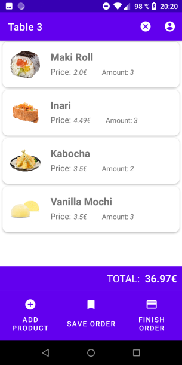
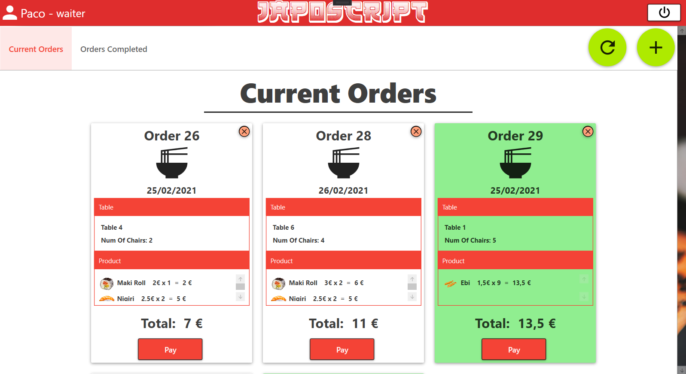

# TPV de un restaurante
Proyecto Intermodular para DAM.
Desarrollo de un TPV enfocado en un Restaurante
- Android - IDE Android Studio (Java)
- Desktop App - Visual Studio (C#)
- API Rest conectada a Firebase

## Android

## Visual Studio

